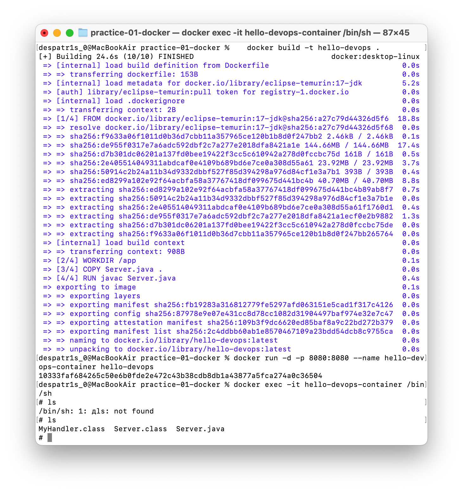

# DevOps Labs

Репозиторій з практичними роботами курсу з основ контейнеризації (Docker).

## Практична робота №1: Основи контейнеризації (Dockerfile)

Простий Java HTTP-сервер, запакований у Docker-образ. Сервер відповідає текстом
"Hello DevOps!" на порту 8080.

### Структура
practice-01-docker/
├── Dockerfile
├── Server.java
└── screenshots/
├── screenshot-1-browser.png
└── screenshot-2-terminal-exec.png

### Вміст Dockerfile

```dockerfile
FROM eclipse-temurin:17-jdk
WORKDIR /app
COPY Server.java .
RUN javac Server.java
EXPOSE 8080
CMD ["java", "Server"]
```

### Команди

Збірка образу:
docker build -t hello-devops .

Запуск контейнера:
docker run -d -p 8080:8080 --name hello-devops-container hello-devops

Перевірка результату — відкрити в браузері `http://localhost:8080`.

Вхід усередину контейнера:
docker exec -it hello-devops-container /bin/sh

### Скріншот 1 — сайт у браузері


### Скріншот 2 — docker exec

